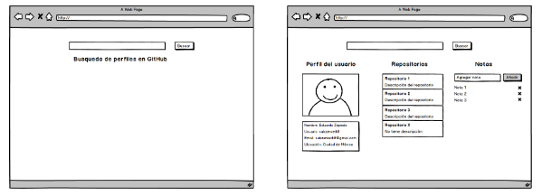
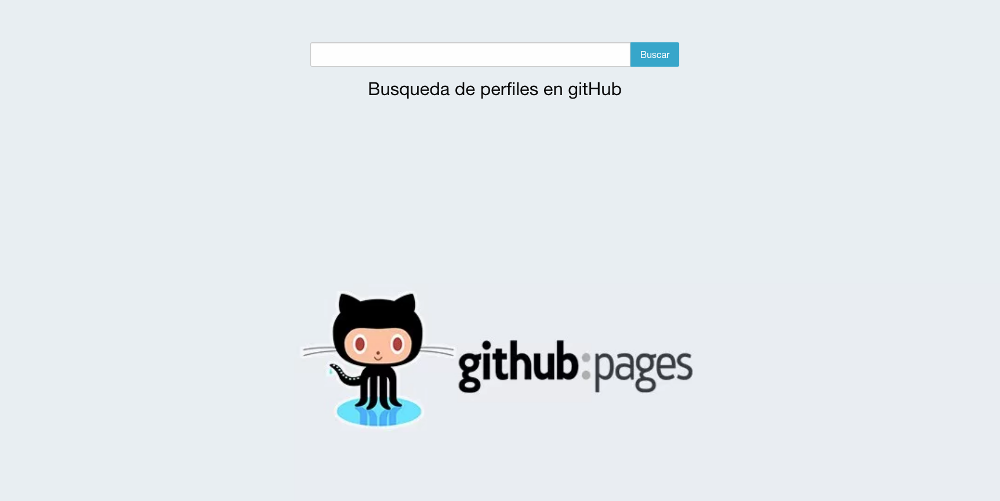
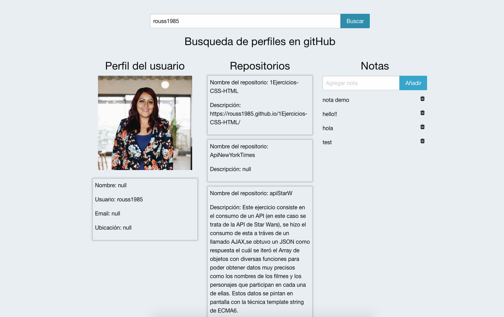

Ejercicio técnico donde de utiliza la API de gitHub para poder tener acceso
a los datos y repositorios de cada usuario de esta aplicación, y así manipularlos
y pintarlos de manera dinámica en el index.

También se hace uso de Firebase para poder utilizar la dataBase para el guardado de notas que el usuario genere en la aplicación,
y así poder tener acceso a esas notas de manera dinámica y poderlas mostrar en tiempo real.

Herramientas técnicas utilizadas: HTML, CSS3, AJAX, Jquery, ECMASCRIPT6 , Framework Foundation, API de GitHub, Firebase.

Este es el link de la gitHub Pages del ejercicio: https://rouss1985.github.io/prueba-tecnica/

Mockups propuestos:

Resultado final de la aplicación:

